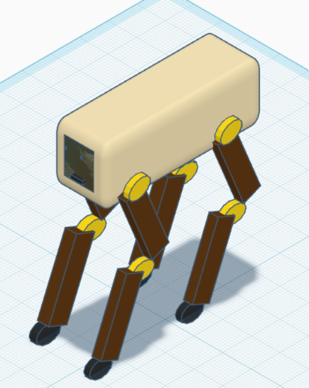

<h1 align="center"> Robotic Dog - Mechanical Design 🤖 </h1>

Initial mechanical design of a simple quadruped robot created using Tinkercad.

  

---

## 📖 Overview

This project presents the initial mechanical design of a simple robotic dog developed using Tinkercad as part of the Mechanical Track.

The project focuses on designing the robot body, legs, joints, and mechanical structure while applying the basic concepts required for a quadruped robot.

---

## ✨ Features

- Four-legged robotic design
- Simple mechanical structure
- 8 mechanical joints
- 8 Degrees of Freedom (DOF)
- Servo motor concept
- Exported STL model

---

## ⚙️ Mechanical Design Summary

- Number of Legs: 4
- Joints: 8 (2 per leg)
- Degrees of Freedom (DOF): 8
- Arm Length: 8 cm
- Selected Motor: Servo Motor (MG996R)
- Preliminary Torque: ≈ 1.0 kg·cm
- Proposed Gait: Crawl Gait

---

## 🛠️ Design Tool

- Tinkercad

---

## 🎯 Project Objective

The objective of this project is to understand the basic mechanical principles involved in designing a quadruped robot, including body structure, leg configuration, joints, and overall stability before building a physical prototype.

---

## 👩‍💻 Author

Sama Alzahrani

## 📄 Project Report

The detailed mechanical design report is included in this repository as a PDF document.

- Initial Mechanical Design of a Simple Robotic Dog.pdf
